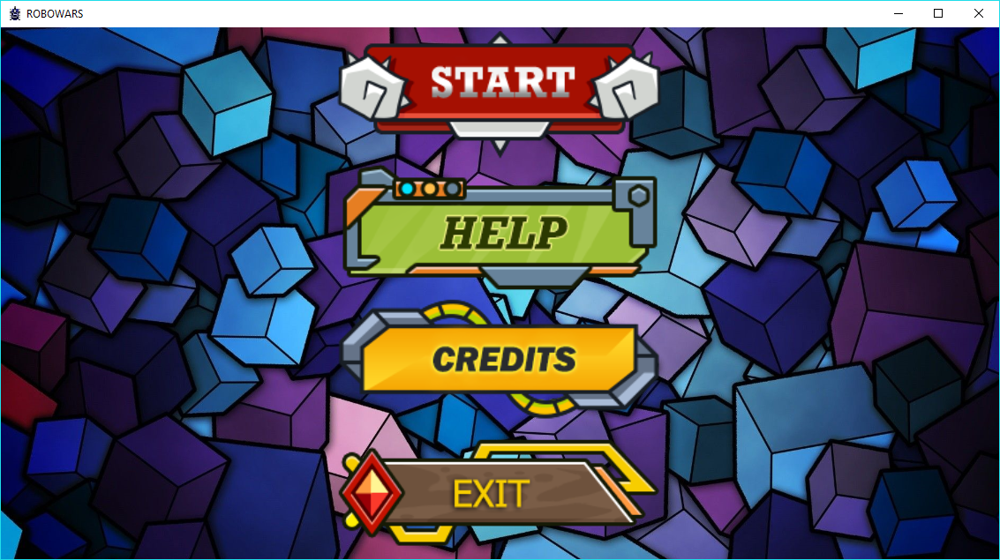
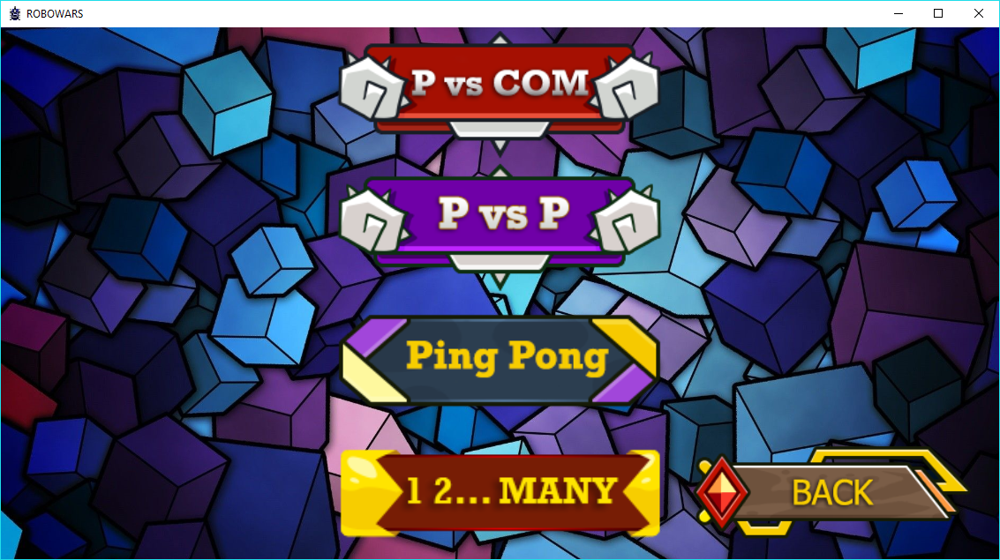
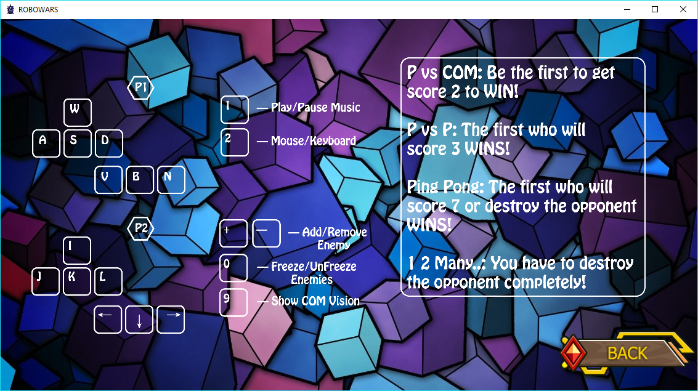
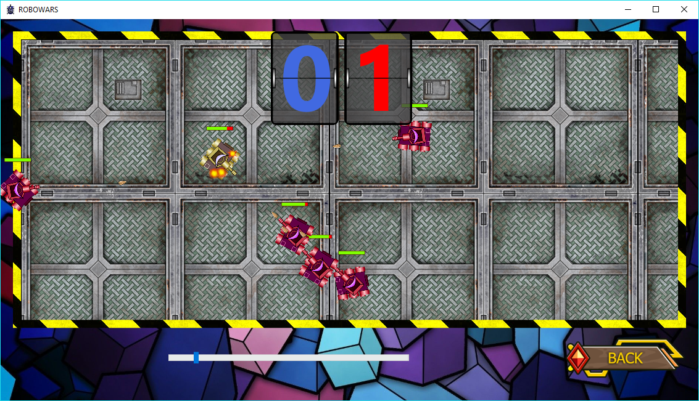
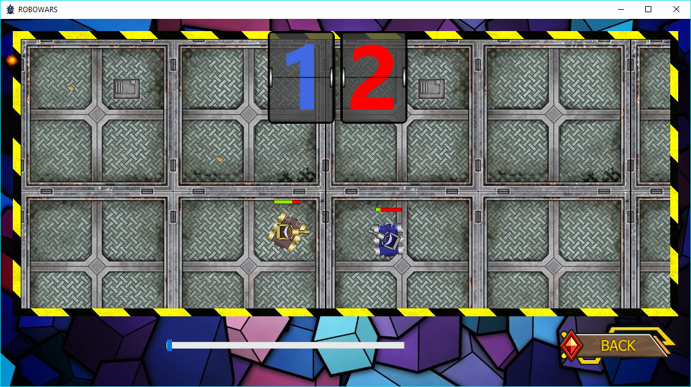
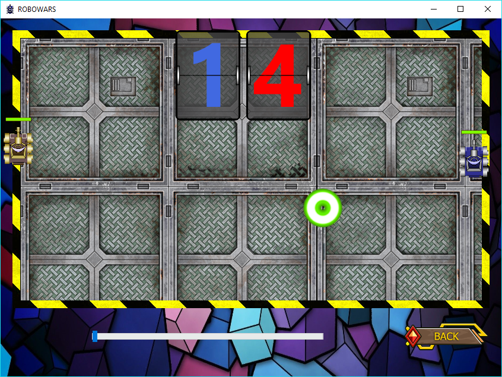
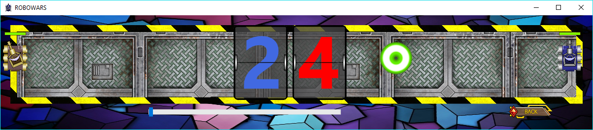
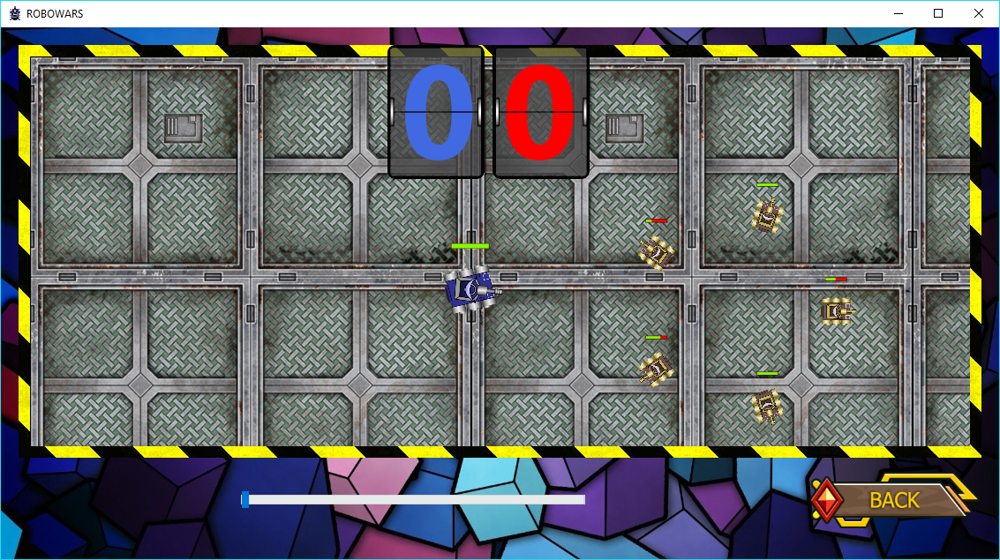

# RoboWars

The main goal of this project was to create an AI that implements predictive shooting and maintaining an optimal distance to the target. It is possible to enable visualization of target points calculated by AI. There are also several game modes including cooperative ones. All details are in the NOTE.docx.

